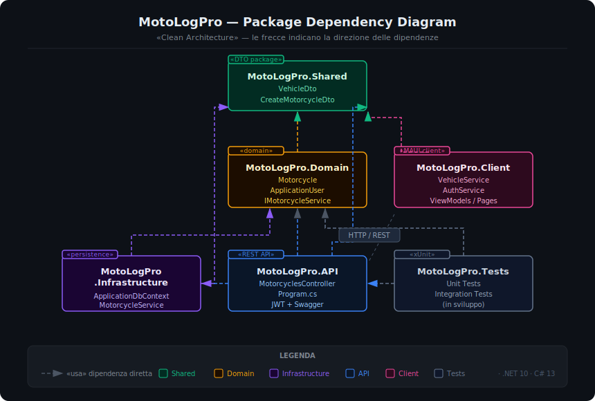

# 🏍️ MotoLogPro


> **"Dal cacciavite al compilatore."**  
> Un sistema di gestione officina Enterprise-grade costruito con .NET 10 e Clean Architecture.

---

## 💡 Il Progetto

**MotoLogPro** nasce dall'esigenza reale di unire la precisione meccanica con l'astrazione del software. Sviluppato da un Montatore Meccanico e Software Developer, questo progetto mira a simulare uno scenario aziendale completo per la gestione di flotte moto, interventi di manutenzione e clienti.

L'obiettivo tecnico è dimostrare l'applicazione di pattern architetturali avanzati e l'uso delle ultimissime tecnologie Microsoft (.NET 10) in un contesto distribuito (Mobile + Cloud).

---

## 🏗️ Architettura



La soluzione segue rigorosamente la **Clean Architecture** per garantire la separazione delle responsabilità (Separation of Concerns), scalabilità e testabilità. È suddivisa in 6 progetti distinti:

| Progetto | Responsabilità |
|---|---|
| `MotoLogPro.Domain` | Entità (`Motorcycle`, `ApplicationUser`), interfacce e logica di business pura. Nessuna dipendenza esterna. |
| `MotoLogPro.Shared` | DTO e contratti condivisi tra API e Client. |
| `MotoLogPro.Infrastructure` | Accesso ai dati (EF Core), DbContext, migrazioni e implementazione dei service. |
| `MotoLogPro.API` | Backend ASP.NET Core Web API. Endpoint REST, autenticazione JWT, error handling globale. |
| `MotoLogPro.Client` | Frontend Cross-Platform in .NET MAUI. UI, MVVM, storage sicuro locale. |
| `MotoLogPro.Tests` | Unit test (xUnit + Moq) e Integration test. |

---

## 🛠️ Stack Tecnologico

* **Framework:** .NET 10
* **Linguaggio:** C# 13
* **Frontend:** .NET MAUI (Android, iOS, Windows, macOS)
* **Backend:** ASP.NET Core Web API
* **Database:** SQL Server (LocalDB per sviluppo)
* **ORM:** Entity Framework Core 10 — Code First
* **Autenticazione:** ASP.NET Core Identity + JWT Bearer Tokens
* **Sicurezza:** SecureStorage (Keychain/Keystore), RBAC
* **Testing:** xUnit, Moq, EF Core InMemory

---

## ✨ Funzionalità (stato attuale)

- [x] **Architettura:** Clean Architecture a 6 layer configurata e stabile.
- [x] **Database:** Migrazioni EF Core, relazioni 1:N (Utente → Moto), campo `LicensePlate` allineato su domain e DTO.
- [x] **Autenticazione:** Registrazione, Login, Logout e refresh JWT Token.
- [x] **Client Mobile:** Login/Logout funzionante, Dashboard con lista veicoli, stati di errore e lista vuota distinti.
- [x] **Error Handling:** Middleware globale su API con risposte `ProblemDetails` standardizzate (RFC 7807).
- [ ] **Gestione Moto:** CRUD completo lato client (aggiunta, modifica, cancellazione veicolo).
- [ ] **Interventi:** Storico manutenzione per veicolo (tagliandi, riparazioni, revisioni).
- [ ] **Dashboard:** Viste differenziate per ruolo (Admin, Meccanico, Cliente).
- [ ] **Integrazione esterna:** Decodifica VIN tramite API NHTSA.

---

## 🚀 Come iniziare

### Prerequisiti
* Visual Studio 2022 con workload **.NET MAUI** e **ASP.NET** installati.
* .NET 10 SDK.
* SQL Server Express o LocalDB.

### Installazione

1. **Clona la repository:**
    ```bash
    git clone https://github.com/Mugen85/MotoLogPro.git
    ```

2. **Crea il database** dalla Package Manager Console di Visual Studio:
    ```powershell
    Update-Database -Project MotoLogPro.Infrastructure -StartupProject MotoLogPro.API
    ```

3. **Registra il primo utente** avviando `MotoLogPro.API` e usando Swagger (`/swagger`) → `POST /register`.

4. **Avvia il Client** selezionando `MotoLogPro.Client` come progetto di avvio.
    > **Nota Android:** l'emulatore usa `10.0.2.2` per raggiungere il localhost del PC. La configurazione è già gestita in `MauiProgram.cs`.

---

## 🧪 Test

```bash
dotnet test
```

Il progetto `MotoLogPro.Tests` include:
* **Unit test** sul service layer (`MotorcycleServiceTests`) con DB InMemory.
* **Unit test** sul controller layer (`MotorcyclesControllerTests`) con Moq.

---

## 🤝 Contribuisci & Feedback

Progetto open-source nato per passione e apprendimento. Feedback, PR e suggerimenti sono benvenuti, specialmente su:
* Ottimizzazioni EF Core.
* Miglioramenti UI/UX in MAUI.
* Copertura dei test.

---

## ☕ Supporta il progetto

Se questo progetto ti è utile o ti ha ispirato, considera di offrirmi un caffè!

[](https://paypal.me/wildmak)

---
*Developed with ❤️, passion and mechanical precision.*