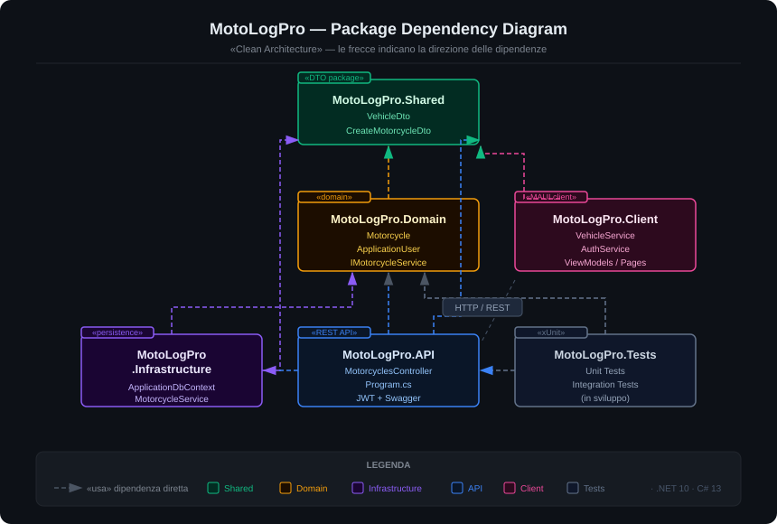

# 🏍️ MotoLogPro


> **"Dal cacciavite al compilatore."**  
> Un sistema di gestione officina Enterprise-grade costruito con .NET 10 e Clean Architecture.

---

## 📱 Screenshots

> *Screenshots coming soon — app currently in active development.*

---

## 💡 Il Progetto

**MotoLogPro** nasce dall'esigenza reale di unire la precisione meccanica con l'astrazione del software. Sviluppato da un Montatore Meccanico e Software Developer, questo progetto mira a simulare uno scenario aziendale completo per la gestione di flotte moto, interventi di manutenzione e clienti.

L'obiettivo tecnico è dimostrare l'applicazione di pattern architetturali avanzati e l'uso delle ultimissime tecnologie Microsoft (.NET 10) in un contesto distribuito (Mobile + Cloud).

---

## 🏗️ Architettura



La soluzione segue rigorosamente i principi della **Clean Architecture** per garantire la separazione delle responsabilità, la scalabilità e la testabilità. È suddivisa in 6 progetti distinti:  a 6 strati:

1. **Domain:** Entità core (Motorcycle, ApplicationUser) isolate e prive di dipendenze esterne.  
2. **Shared:** DTOs (es. VehicleDto) condivisi tra Client e API per garantire type-safety assoluta.  
3. **Infrastructure:** Contesto EF Core, Migrations e logica di accesso ai dati (Service Layer).  
4. **API:** Vigile urbano RESTful. Espone gli endpoint, valida i token JWT e smista il traffico.  
5. **Client:** App .NET MAUI "Zero-Scroll" pattern MVVM per l'uso pratico in officina con mani sporche.  
6. **Tests:** Suite xUnit (con Moq e InMemory DB) per collaudare il blocco motore.

### **🛠️ Focus Architetturale: Riparare il motore, non la spia (Test vs Architettura)**

Durante lo sviluppo del flusso di aggiunta veicoli (CRUD), un test unitario sul Controller falliva simulando l'inserimento di un Telaio (VIN) duplicato. Invece di "hackerare" il test per farlo passare ciecamente, **è stata blindata l'architettura**:

* **Clean Controller:** Il Controller REST non ha idea di cosa sia Entity Framework. Non contiene blocchi catch per DbUpdateException, mantenendo intatta la *Separation of Concerns*.  
* **GlobalExceptionMiddleware:** Come una centralina diagnostica, un middleware globale cattura le eccezioni non gestite (es. violazioni di unicità nel DB), le decodifica e restituisce al client un JSON standard ProblemDetails (HTTP 409 Conflict).  
* **Test Architetturale:** Il test unitario è stato allineato per verificare l'architettura e non le singole stringhe: il test si assicura che l'eccezione "attraversi" il Controller senza essere bloccata, destinata ad essere gestita in totale trasparenza dal Middleware.  
* **Client Resiliente:** L'app MAUI (tramite System.Text.Json puro) spacchetta in sicurezza il ProblemDetails JSON e restituisce all'utente un messaggio diagnostico pulito, evitando crash dell'applicazione.

## **✨ Features Attuali (Log di Officina)**

* **Sicurezza & Autenticazione:** Login e Registrazione gestiti tramite ASP.NET Core Identity API Endpoints. Token JWT immagazzinati tramite SecureStorage nativo.  
* **Gestione Veicoli (CRUD Completo):**  
  * Dashboard MVVM con lista veicoli tramite CollectionView.  
  * Flusso d'inserimento nuova moto (VehicleDetailPage) protetto da JWT automatico.  
  * Gestione e visualizzazione di errori server/strutturali (es. VIN duplicato) senza impattare l'esperienza utente.  
* **Automazione HTTP:** Il client MAUI intercetta e inietta dinamicamente gli header di Autorizzazione (Bearer) in tutte le chiamate API grazie al VehicleService. È suddivisa in 6 progetti distinti:

| Progetto | Responsabilità |
|---|---|
| `MotoLogPro.Domain` | Entità (`Motorcycle`, `ApplicationUser`), interfacce e logica di business pura. Nessuna dipendenza esterna. |
| `MotoLogPro.Shared` | DTO e contratti condivisi tra API e Client. |
| `MotoLogPro.Infrastructure` | Accesso ai dati (EF Core), DbContext, migrazioni e implementazione dei service. |
| `MotoLogPro.API` | Backend ASP.NET Core Web API. Endpoint REST, autenticazione JWT, error handling globale. |
| `MotoLogPro.Client` | Frontend Cross-Platform in .NET MAUI. UI, MVVM, storage sicuro locale. |
| `MotoLogPro.Tests` | Unit test (xUnit + Moq) e Integration test. |

---

## 🛠️ Stack Tecnologico

* **Framework:** .NET 10
* **Linguaggio:** C# 13
* **Frontend:** .NET MAUI (Android, iOS, Windows, macOS)
* **Backend:** ASP.NET Core Web API
* **Database:** SQL Server (LocalDB per sviluppo)
* **ORM:** Entity Framework Core 10 — Code First
* **Autenticazione:** ASP.NET Core Identity + JWT Bearer Tokens
* **Sicurezza:** SecureStorage (Keychain/Keystore), RBAC
* **Testing:** xUnit, Moq, EF Core InMemory

---

## ✨ Funzionalità (stato attuale)

- [x] **Architettura:** Clean Architecture a 6 layer configurata e stabile.
- [x] **Database:** Migrazioni EF Core, relazioni 1:N (Utente → Moto), campo `LicensePlate` allineato su domain e DTO.
- [x] **Autenticazione:** Registrazione, Login, Logout e refresh JWT Token.
- [x] **Client Mobile:** Login/Logout funzionante, Dashboard con lista veicoli, stati di errore e lista vuota distinti.
- [x] **Error Handling:** Middleware globale su API con risposte `ProblemDetails` standardizzate (RFC 7807).
- [ ] **Gestione Moto:** CRUD completo lato client (aggiunta, modifica, cancellazione veicolo).
- [ ] **Interventi:** Storico manutenzione per veicolo (tagliandi, riparazioni, revisioni).
- [ ] **Dashboard:** Viste differenziate per ruolo (Admin, Meccanico, Cliente).
- [ ] **Integrazione esterna:** Decodifica VIN tramite API NHTSA.

---

## 🚀 Come iniziare

### Prerequisiti
* Visual Studio 2022 con workload **.NET MAUI** e **ASP.NET** installati.
* .NET 10 SDK.
* SQL Server Express o LocalDB.

### Installazione

1. **Clona la repository:**
    ```bash
    git clone https://github.com/Mugen85/MotoLogPro.git
    ```

2. **Crea il database** dalla Package Manager Console di Visual Studio:
    ```powershell
    Update-Database -Project MotoLogPro.Infrastructure -StartupProject MotoLogPro.API
    ```

3. **Registra il primo utente** avviando `MotoLogPro.API` e usando Swagger (`/swagger`) → `POST /register`.

4. **Avvia il Client** selezionando `MotoLogPro.Client` come progetto di avvio.
    > **Nota Android:** l'emulatore usa `10.0.2.2` per raggiungere il localhost del PC. La configurazione è già gestita in `MauiProgram.cs`.

---

## 🧪 Test

```bash
dotnet test
```

Il progetto `MotoLogPro.Tests` include:
* **Unit test** sul service layer (`MotorcycleServiceTests`) con DB InMemory.
* **Unit test** sul controller layer (`MotorcyclesControllerTests`) con Moq.

---

## 🤝 Contribuisci & Feedback

Progetto open-source nato per passione e apprendimento. Feedback, PR e suggerimenti sono benvenuti, specialmente su:
* Ottimizzazioni EF Core.
* Miglioramenti UI/UX in MAUI.
* Copertura dei test.

---

## ☕ Supporta il progetto

Se questo progetto ti è utile o ti ha ispirato, considera di offrirmi un caffè!

[](https://paypal.me/wildmak)

---
*Developed with ❤️, passion and mechanical precision.*

---

# 🇬🇧 English Version

# 🏍️ MotoLogPro

> **"From the wrench to the compiler."**
> An Enterprise-grade workshop management system built with .NET 10 and Clean Architecture.

---

## 💡 The Project

**MotoLogPro** was born from a real need to bridge mechanical precision with software abstraction. Developed by a Mechanical Assembler turned Software Developer, this project simulates a complete business scenario for managing motorcycle fleets, maintenance jobs, and customers.

The technical goal is to demonstrate advanced architectural patterns and the latest Microsoft technologies (.NET 10) in a distributed context (Mobile + Cloud).

---

## 🏗️ Architecture


The solution strictly follows **Clean Architecture** to ensure Separation of Concerns, scalability, and testability.  It is split into 6 distinct projects:

| Project | Responsibility |
|---|---|
| `MotoLogPro.Domain` | Entities (`Motorcycle`, `ApplicationUser`), interfaces and pure business logic. No external dependencies. |
| `MotoLogPro.Shared` | DTOs and shared contracts between API and Client. |
| `MotoLogPro.Infrastructure` | Data access (EF Core), DbContext, migrations and service implementations. |
| `MotoLogPro.API` | ASP.NET Core Web API backend. REST endpoints, JWT auth, global error handling. |
| `MotoLogPro.Client` | Cross-Platform frontend in .NET MAUI. UI, MVVM, secure local storage. |
| `MotoLogPro.Tests` | Unit tests (xUnit + Moq) and Integration tests. |

While developing the add vehicle flow (CRUD), a Controller unit test failed when simulating a duplicate VIN insertion. Instead of blindly "hacking" the test to make it pass, **the architecture was bulletproofed**:

* **Clean Controller:** The REST Controller has no knowledge of Entity Framework. It avoids using catch blocks for DbUpdateException, keeping the *Separation of Concerns* intact.  
* **GlobalExceptionMiddleware:** Acting like a diagnostic control unit (ECU), a global middleware catches unhandled exceptions (e.g., DB uniqueness violations), decodes them, and returns a standard ProblemDetails JSON to the client (HTTP 409 Conflict).  
* **Architectural Testing:** The unit test was refactored to verify the architecture rather than hardcoded strings: the test ensures the exception "passes through" the Controller unblocked, intended to be handled seamlessly by the Middleware.  
* **Resilient Client:** The MAUI app (using pure System.Text.Json) safely unpacks the ProblemDetails JSON and returns a clean diagnostic message to the user, preventing application crashes.

## **✨ Current Features (Workshop Log)**

* **Security & Authentication:** Login and Registration handled via ASP.NET Core Identity API Endpoints. JWT tokens are securely stored using the device's native SecureStorage.  
* **Vehicle Management (Full CRUD):**  
  * MVVM Dashboard featuring a vehicle list via CollectionView.  
  * New motorcycle insertion flow (VehicleDetailPage) protected by automatic JWT authorization.  
  * Graceful handling and visualization of server/structural errors (e.g., duplicate VIN) without impacting the user experience.  
* **HTTP Automation:** The MAUI client dynamically intercepts and injects Authorization headers (Bearer) into all API calls thanks to the VehicleService.

---

## 🛠️ Tech Stack

* **Framework:** .NET 10
* **Language:** C# 13
* **Frontend:** .NET MAUI (Android, iOS, Windows, macOS)
* **Backend:** ASP.NET Core Web API
* **Database:** SQL Server (LocalDB for development)
* **ORM:** Entity Framework Core 10 — Code First
* **Authentication:** ASP.NET Core Identity + JWT Bearer Tokens
* **Security:** SecureStorage (Keychain/Keystore), RBAC
* **Testing:** xUnit, Moq, EF Core InMemory

---

## ✨ Features (current status)

- [x] **Architecture:** 6-layer Clean Architecture configured and stable.
- [x] **Database:** EF Core migrations, 1:N relationships (User → Motorcycle), `LicensePlate` field aligned across domain and DTO.
- [x] **Authentication:** Registration, Login, Logout and JWT Token refresh.
- [x] **Mobile Client:** Login/Logout working, Dashboard with vehicle list, distinct error and empty states.
- [x] **Error Handling:** Global middleware on API with standardized `ProblemDetails` responses (RFC 7807).
- [ ] **Motorcycle Management:** Full CRUD on client side (add, edit, delete vehicle).
- [ ] **Service History:** Maintenance log per vehicle (services, repairs, inspections).
- [ ] **Dashboard:** Role-based views (Admin, Mechanic, Customer).
- [ ] **External Integration:** VIN decoding via NHTSA API.

---

## 🚀 Getting Started

### Prerequisites
* Visual Studio 2022 with **.NET MAUI** and **ASP.NET** workloads installed.
* .NET 10 SDK.
* SQL Server Express or LocalDB.

### Installation

1. **Clone the repository:**
```bash
    git clone https://github.com/Mugen85/MotoLogPro.git
```

2. **Create the database** from Visual Studio's Package Manager Console:
```powershell
    Update-Database -Project MotoLogPro.Infrastructure -StartupProject MotoLogPro.API
```

3. **Register the first user** by running `MotoLogPro.API` and using Swagger (`/swagger`) → `POST /register`.

4. **Launch the Client** by setting `MotoLogPro.Client` as the startup project.
    > **Android note:** the emulator uses `10.0.2.2` to reach the PC's localhost. This is already handled in `MauiProgram.cs`.

---

## 🧪 Tests
```bash
dotnet test
```

The `MotoLogPro.Tests` project includes:
* **Unit tests** on the service layer (`MotorcycleServiceTests`) with InMemory DB.
* **Unit tests** on the controller layer (`MotorcyclesControllerTests`) with Moq.

---

## 🤝 Contribute & Feedback

Open-source project born from passion and learning. Feedback, PRs and suggestions are welcome, especially on:
* EF Core optimizations.
* UI/UX improvements in MAUI.
* Test coverage.

---

## ☕ Support the project

If this project was useful or inspired you, consider buying me a coffee!

[](https://paypal.me/wildmak)

---
*Developed with ❤️, passion and mechanical precision.*
